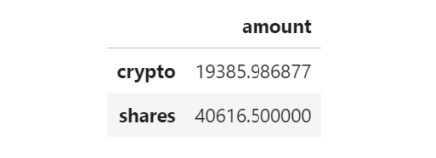
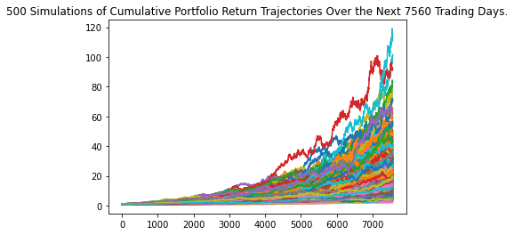

# Financial-Planning-for-Credit-Unions

## Background

With my new FinTech consultancy firm, I want to make a difference by working on projects with high social impact in local communities. I won my first contract to help one of the biggest credit unions in the area. I created a tool that helps the members of Credit Union company to enhance their financial health. As per the request of The Chief Technology Officer (CTO) of the credit union, I have developed a prototype application to demo in the next credit union assembly.

The credit union board wants to allow the union's members to assess their monthly personal finances, and also be able to forecast a reasonably good retirement plan based on cryptocurrencies, stocks, and bonds.

In this tool, I have used all the skills I learnt until now - focusing on using APIs as part of the technical solution - to create two financial analysis tools.

The first tool is a personal finance planner that will allow users to visualize their savings composed by investments in shares and cryptocurrencies to assess if they have enough money as an emergency fund.

The second tool will be a retirement planning tool that will use the Alpaca API to fetch historical closing prices for a retirement portfolio composed of stocks and bonds, then run Monte Carlo simulations to project the portfolio performance at 30 years. I have used the Monte Carlo data to calculate the expected portfolio returns given a specific initial investment amount.

---

### Files

* [Personal Finance Planner starter code](financial-planner.ipynb)

* [MCForecastTools toolkit](MCForecastTools.py)

---

### Resources

This Tool will utilize two APIs:

* The **Alpaca Markets API** is used to pull historical stocks and bonds information.  
    
* The **Alternative Free Crypto API** is used to retrieve Bitcoin and Ethereum prices.

The documentation for these APIs can be found via the following links:

* [Free Crypto API Documentation](https://alternative.me/crypto/api/)

* [AlpacaDOCS](https://alpaca.markets/docs/)
---

## Procedure

### Part 1 - Personal Finance Planner

In this tool I have created a personal finance planner application. To develop the personal finance planner prototype, the following assumptions are taken into account :

* The average household income for each member of the credit union is $12,000.

* Every union member has a savings portfolio composed of cryptocurrencies, stocks and bonds:

    * Assumed the following amount of crypto assets: `1.2` BTC and `5.3` ETH.

    * Assumed the following amount of shares in stocks and bonds: `50` SPY (stocks) and `200` AGG (bonds).

#### Collecting Crypto Prices Using the `requests` Library

1. I created two variables called `my_btc` and `my_eth`. Set them equal to `1.2` and `5.3`, respectively.

2. Useing the `requests` library I fetched the current price in Canadian dollars of bitcoin (`BTC`) and ethereum (`ETH`) using the **Alternative Free Crypto API** for the endpoints.

3. Parse the API JSON response to select only the crypto prices and stored each price in a variable.

    (the identifier for each cryptocurrency in the API JSON response - the bitcoin identifier is `1` and ethereum is `1027`.)

4. I Computed the portfolio value of cryptocurrencies and printed the results.

#### Collecting Investments Data Using Alpaca: `SPY` (stocks) and `AGG` (bonds)

1. Created two variables named `my_agg` and `my_spy` and set them equal to `200` and `50`, respectively.

2. I set the Alpaca API key and secret key variables, then created the Alpaca API object using the `tradeapi.REST` function from the Alpaca SDK.

3. Formated the current date as ISO format. 

4. After geting the current closing prices for `SPY` and `AGG` using Alpaca's `get_barset()` function, I transformed the function's response to a Pandas DataFrame and previewed the data.

5. I picked the `SPY` and `AGG` close prices from the Alpaca's `get_barset()` DataFrame response and stored them as Python variables. Printed the closing values for validation. Added the parameter `limit=1000` to the function call in order to receive back as much data from Alpaca as possible.

6. Computed the value in dollars of the current amount of shares and printed the results.

#### Savings Health Analysis

In this task, the financial health of the credit union's members can be assessed.

1. I created a variable called `monthly_income` and set its value to `12000`.

2. To analyze savings health, I created a DataFrame called `df_savings` with two rows. Stored the total value in dollars of the crypto assets in the first row and the total value of the shares in the second row.

   
    

3. Used the `df_savings` DataFrame to plot a pie chart to visualize the composition of personal savings.

4. Useing `if` conditional statements I validated, if the current savings are enough for an emergency fund. An ideal emergency fund should be equal to three times your monthly income.

    * If total savings are greater than the emergency fund, display a message congratulating the person for having enough money in this fund.

    * If total savings are equal to the emergency fund, display a message congratulating the person on reaching this financial goal.

    * If total savings are less than the emergency fund, display a message showing how many dollars away the person is from reaching the goal.

### Part 2 - Retirement Planning

In this section, you will use the Alpaca API to fetch historical closing prices for a retirement portfolio and then Use the MCForecastTools toolkit to create Monte Carlo simulations to project the portfolio performance at `30` years. You will then use the Monte Carlo data to answer questions about the portfolio.

Follow the steps outlined in the starter notebook to complete the following:

#### Monte Carlo Simulation

1. Use the Alpaca API to fetch five years historical closing prices for a traditional `40/60` portfolio using the `SPY` and `AGG` tickers to represent the `60%` stocks (`SPY`) and `40%` bonds (`AGG`) composition of the portfolio. Make sure to convert the API output to a DataFrame and preview the output.

    > *Note*: As before, use the parameter `limit=1000` to ensure you get the most data possible back from the API. In Monte-Carlo Simulation, getting data as far back as possible matters, because if we simulate using only small amounts of data during a recent time when markets are booming, or instead falling precipitously, a Monte-Carlo Analysis will inadvertently extrapolate this temporary market movement too far into the future. Getting data over a longer time period mitigates this effect.

2. Configure and execute a Monte Carlo Simulation of `500` runs and `30` years for the `40/60` portfolio.

3. Plot the simulation results and the probability distribution/confidence intervals.

    
        
    

#### Retirement Analysis

1. Fetch the summary statistics from the Monte Carlo simulation results.

1. Given an initial investment of `$20,000`, calculate the expected portfolio return in dollars at the `95%` lower and upper confidence intervals.

2. Calculate the expected portfolio return at the `95%` lower and upper confidence intervals based on a `50%` increase in the initial investment.

### Optional Challenge - Early Retirement

The CTO of the Credit Union was really impressed with your work on this planner, but commented that `30` years seems like such a long time to wait to retire! The CTO starts wondering if the retirement plan could be adjusted to account for an earlier than normal retirement.

Try adjusting the portfolio to either include more risk (a higher stock than bond ratio) or to have a larger initial investment and rerun the retirement analysis to see what it would take to retire in `5` or `10` years instead of `30`!

---

